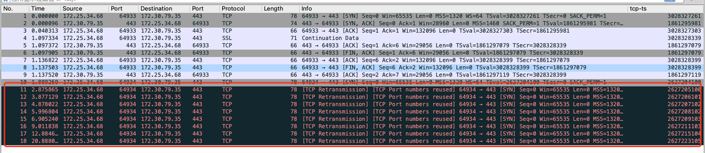

## 故障现象

访问测试环境 customer 服务间歇性 502

## 排查过程

1. 排查 服务后端日志和 ingress 日志，确定 ingress 未收到请求
2. 排查 nginx errror.log 日志，确定是 nginx 连接 upstream （ingress）超时
3. 在本地电脑上直连 ingress 443 端口测试 ，发现（间歇性）超时

```
   telnet 172.30.79.35 443
```

4. 本地打开 wireshark 抓包，发现超时的 TCP 连接，在本机发出 SYN 包后无响应
5. 在服务器端 使用 tcpdump 抓包，发现可以收到 客户端的 SYN 包但是无回复



6. Google 搜索 `TCP SYN` 无响应，参考文章 [《服务端 tcp syn 无响应,无回复》](https://www.cnblogs.com/52py/p/13255095.html)，说可能是因为 TCP 包时间戳乱序被服务器丢弃

> 通过上图中可以看到：
>
> 第一次正常连接时, TCP 包中的 tcp.options.timestamp.tsval 为 3028328399  
> 第二次无响应连接时，对应的时间戳为 2627207102
>
> 符合文章中的描述

7. 按照文章指导，在服务器设置如下：

```
   sysctl -w net.ipv4.tcp_timestamps=0
   sysctl -w net.ipv4.tcp_tw_recycle=0
```

8. 测试，没有再出现连接超时（SYN 无响应）的情况

## 后续问题

1. 为什么客户端 TS 参数会乱？
2. 上述参数配置是否有副作用？
