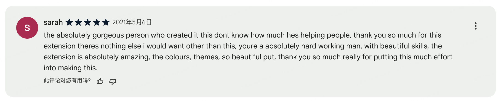
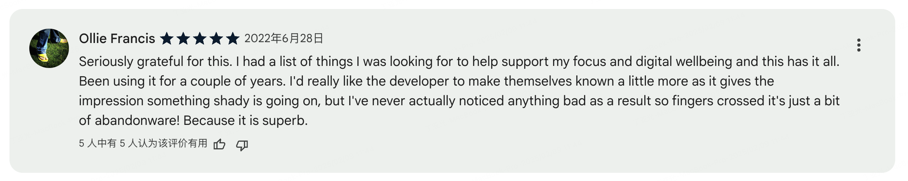
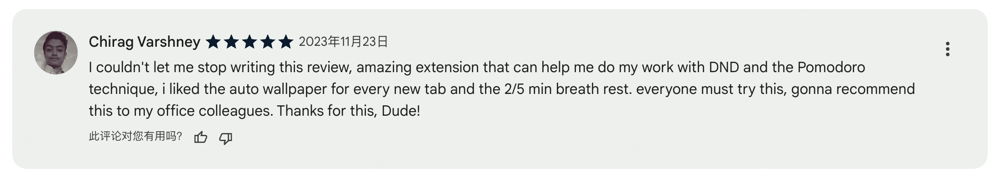
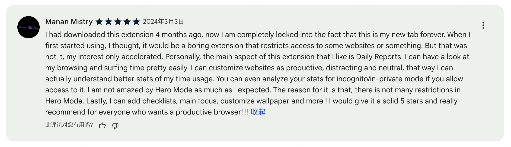

## 缘起

6 年前我开发了一个 Chrome 插件 [MindHero](https://chromewebstore.google.com/detail/mindhero/opjbphlikplllhehiaafnglngompagni)，由来是一个叫 [Digital Wellbeing](https://www.android.com/digital-wellbeing/) 的概念，翻译过来就是数字健康，这个概念关注在数字时代如何保持身心健康。举些例子，比如：如何在信息爆炸的时代保持专注；比如合理的控制使用电子设备的时间。

具体产品形式大概是一个集合了 Momentum + 番茄时钟 + 潮汐 + SiteBlocker + ResuceTime 缝合怪。产品说不上成功，目前的用户数在 3000 左右，也积累了一些用户的好评：

（篇幅有限，只截取了部分<del><b>五星</b></del>评价 😜）

## 变故

然而最近 Google Chrome 正在推行将 Chrome Extension 技术平台从 Manifest V2 升级到 [Manifest V3](https://developer.chrome.com/docs/extensions/develop/migrate/what-is-mv3?hl=zh-cn)。 其中最重要的变化是取消了 Background Page，扩展程序需要使用 Service Worker 来替代。这就引起一些重大的变化：

1. Service Worker 并不是常驻后台的，会在没有活动的一段时间后被 Chrome 销毁，有需求时再激活。
2. Service Worker 里面不支持 DOM 对象。所以某些依赖 DOM 对象的功能（比如播放音频）就无法实现了。

可以看出 Google Chrome 的目的是为了降低资源的消耗，但是 MindHero 的几个核心功能深度依赖上述的 2 个特性，下面我简单解释下 MindHero 是如何依赖上述特性的：

1. 用户时间统计功能：依赖于 Background Page 长期后台运行，从而检测当前活动页面、Chrome 前后台切换、用户离开电脑等状态。
2. 番茄时钟功能：依赖于 Background 进行计时。
3. 白噪音功能：依赖于 Background 进行声音播放（这样关闭 NewTab 页面也可以持续播放声音）。

因此 Manifest V3 对于 MindHero 扩展是一个毁灭性的打击。 MindHero 的大量核心功能将不得不进行阉割：比如不再支持用户时间统计；比如永远需要保持一个 NewTab 页面打开；比如番茄时钟、白噪音功能无法通过 Popup 页面进行联动操作。

所以虽然很不舍，但是我不得不承认 MindHero 的生命即将随着 Chrome 对 Manifest V2 扩展 的停止支持而到达终点。

## 存档

<iframe src="//player.bilibili.com/player.html?isOutside=true&aid=113973953366528&bvid=BV12nNUeHE6u&cid=28298576113&p=1" scrolling="no" border="0" frameborder="no" framespacing="0" allowfullscreen="true" width="100%" height="447px"></iframe>
